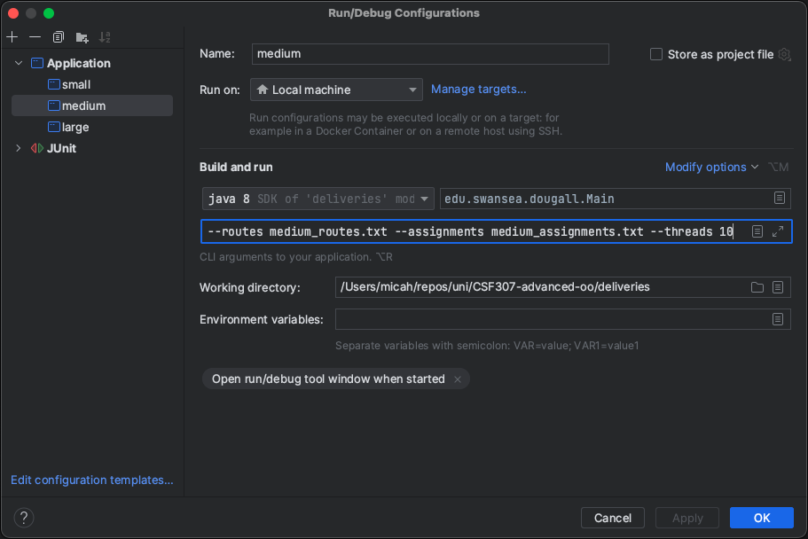

// 

Main is ordered for tasks, rest is top down

lombok, getters

Stack etc


Main thing TODO: is to prove the batched process!

neeed to delete dthe dele4t folder

# CSF307 Advanced Object-Oriented Programming - Coursework 2
<p align="center">
  <br><br>
  
</p>


## Disclosure

The Javadoc comments for this program have been personally written, but with some autocompletion assistance from [GitHub Copilot](https://resources.github.com/copilot-for-business/?ef_id=_k_1736cd150fab1932bdfba98e3c933d0b_k_&OCID=AIDcmm4lwmjeex_SEM__k_1736cd150fab1932bdfba98e3c933d0b_k_&msclkid=1736cd150fab1932bdfba98e3c933d0b).

Inspiration for develping a Breadth-First Search as part of the Dijkstra's algorithm implementation for task 6 has been taken from [Baeldung](https://www.baeldung.com/java-breadth-first-search).


- [Usage](#usage)
- [Performance](#performance)
- [System](#system)
- [References](#references)


## Usage

This program takes optional arguments which can either be supplied via the command-line, or included as a run configuration.

- `-a | --assignments <filename>` &rArr; *Specifies the file in [resources](src/main/resources) to be used for loading assignments, default=assignments.txt.*
- `-r | --routes <filename>` &rArr; *Specifies the file in [resources](src/main/resources) to be used for loading routes, default=routes.txt.*
- `-t  | --threads <n>` &rArr; *The number of threads to use for parallel processing, default=10.*
- `-p | --print <n>` &rArr; *Specifies the number of records to output to the console for reporting, default=20.*
- `-d` &rArr; *This will print detailed information during file loading, exclude to receive a summary only.*

**NB: All arguments are optional.**

The author has tested this program using run configurations as per the following:
```bash
# In src/main/java/edu/swansea/dougall/
java Main --routes routes.txt --assignments assignments.txt --threads 10
```

<p align="center">
  <br><br>
</p>

## Implementation

For task 4, it should be noted that de-duplication of assignments occur during the parsing step as seen in `parseAssignments` in the [DeliveryManager](src/main/java/edu/swansea/dougall/controller/DeliveryManager.java). The de-duplication takes account of the priority of the duplicated assignment to ensure that a high priority assignment is not designated a lower priority due to a data input error.

A similar logic is also applied to the routes which are read into the manager in `parseRoutes`. This is to remove any surplus routes which clog the network but do not offer any value. In this case, the costs of the routes are compared such that only the *lower* cost route is kept in the network. This is effectively pre-optimising the network by taking advantage of multiple options for the same route.

## Performance

In testing, the performance times for parallel versus streaming for the *large* files were as follows:

- Parallel: 30,276 milliseconds.
- Streaming: 165,894 milliseconds

These are printed as part of the program execution.

## System

This code has been developed using:
- ~~Late nights and head scratching~~
- Macbook Pro M1
- IntelliJ IDEA 2022.3.2 (Ultimate Edition)
- A somewhat exhausted rubber duck
- Java 8 (Oracle OpenJDK version 1.8.0_202)

## References

- https://www.baeldung.com/java-breadth-first-search
